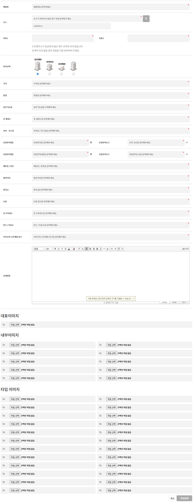
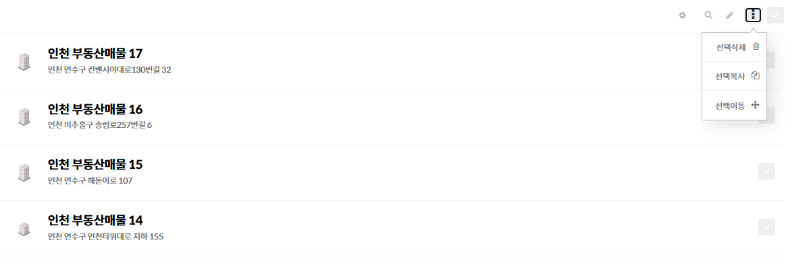
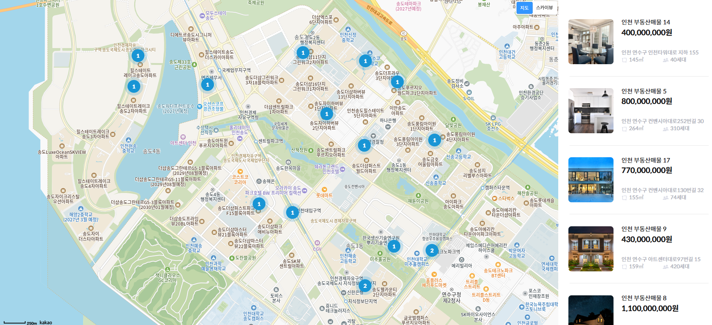
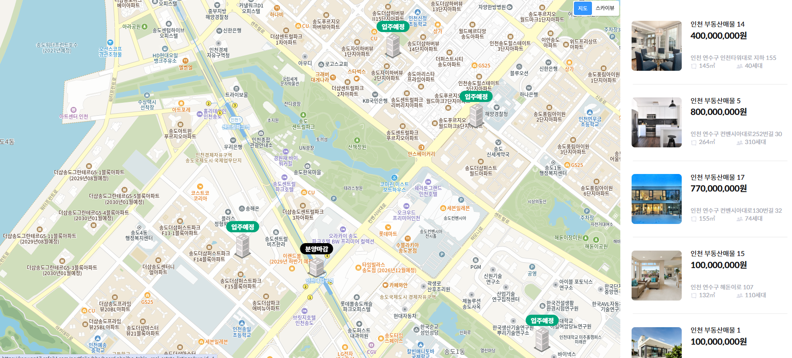

# 프로젝트 이름

부동산중개

## 🔗 데모
[링크]([https://example.com](https://keewon17.cafe24.com/portfolio/theme/CKW/html/property-list.php#Back))

---

## 📖 소개

카카오맵 API와 Ajax를 활용하여 지도 기반 부동산 매물 조회 기능을 구현한 반응형 웹 프로젝트입니다.

그누보드 게시판을 커스텀하여 관리자가 매물을 손쉽게 등록·관리할 수 있도록 구성하였으며,  
사용자는 지도 중심의 UI를 통해 주변 매물을 직관적으로 탐색할 수 있습니다.

지도 이동 및 확대/축소 시 Ajax 비동기 통신으로 매물 데이터를 실시간 갱신하도록 구현하였고,  
매물 리스트·상세 패널·갤러리 UI를 구성하여 직방·다방 스타일의 사용자 경험을 구현하였습니다.

실제 서비스 형태를 고려하여 반응형 레이아웃, 마커 클러스터링, 상세 정보 패널,  
게시판 기반 데이터 관리 구조 등을 중점적으로 작업하였습니다.

---

## 🛠 사용 기술

---

## 사용방법 - 매물등록

### 1. 관리자 매물 등록

관리자는 매물을 등록/편집 할 수 있습니다.
주소를 검색하면 좌표가 반환되며, 확대 마커(입주예정, 분양마감, 분양예정, 일반)등을 선택할 수 있으며
부동산 정보(가격, 방향, 입주 가능일 등...)을 입력할 수 있습니다.

### 2. 관리자_매물리스트

---

## 매물 리스트 (사용자, Kakao Map)

### 1. 지도 축소 시 (클러스터, Clusterer)

### 2. 지도 확대 시 (마커, Marker)

